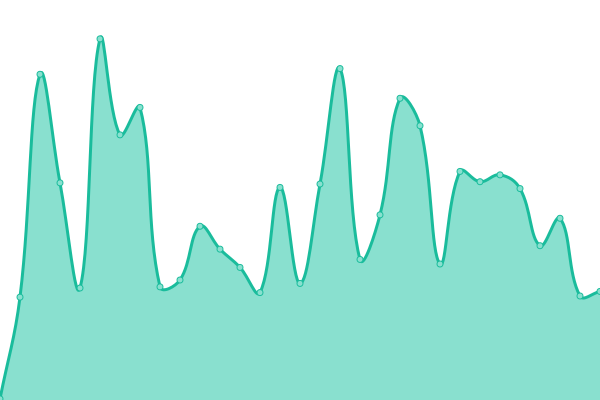
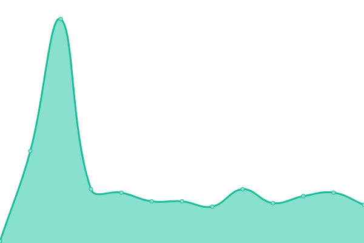
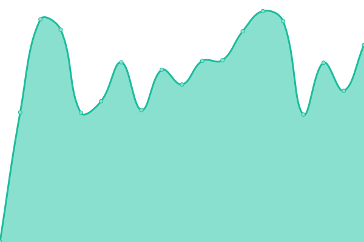
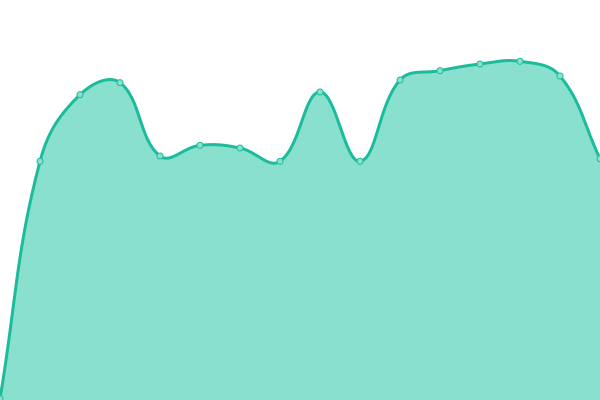
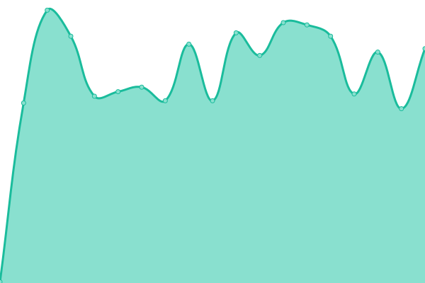

# [📈 Live Status](https://VicmapSpatialServices.github.io/vicmap-upptime): <!--live status--> **🟧 Partial outage**

This repository contains the open-source uptime monitor and status page for [VicmapSpatialServices](https://VicmapSpatialServices.github.io/vicmap-upptime), powered by [Upptime](https://github.com/upptime/upptime).

With [Upptime](https://upptime.js.org), you can get your own unlimited and free uptime monitor and status page, powered entirely by a GitHub repository. We use [Issues](https://github.com/VicmapSpatialServices/vicmap-upptime/issues) as incident reports, [Actions](https://github.com/VicmapSpatialServices/vicmap-upptime/actions) as uptime monitors, and [Pages](https://VicmapSpatialServices.github.io/vicmap-upptime) for the status page.

<!--start: status pages-->
<!-- This summary is generated by Upptime (https://github.com/upptime/upptime) -->
<!-- Do not edit this manually, your changes will be overwritten -->
<!-- prettier-ignore -->
| URL | Status | History | Response Time | Uptime |
| --- | ------ | ------- | ------------- | ------ |
|  [AGOL-Vicmap_Admin](https://services6.arcgis.com/GB33F62SbDxJjwEL/ArcGIS/rest/services/Vicmap_Admin/FeatureServer/0/query?where=1%3D1&resultRecordCount=1&sqlFormat=none&f=pjson) | 🟩 Up | [agol-vicmap-admin.yml](https://github.com/VicmapSpatialServices/vicmap-upptime/commits/HEAD/history/agol-vicmap-admin.yml) | 

 175ms
     
 | 

<a href="https://VicmapSpatialServices.github.io/vicmap-upptime/history/agol-vicmap-admin">100.00%</a>
    

|  [AGOL-Vicmap_Admin_error](https://services6.arcgis.com/GB33F62SbDxJjwEL/ArcGIS/rest/services/Vicmap_Admin_error/FeatureServer/0/query?where=1%3D1&resultRecordCount=1&sqlFormat=none&f=pjson) | 🟥 Down | [agol-vicmap-admin-error.yml](https://github.com/VicmapSpatialServices/vicmap-upptime/commits/HEAD/history/agol-vicmap-admin-error.yml) | 

 44ms
     
 | 

<a href="https://VicmapSpatialServices.github.io/vicmap-upptime/history/agol-vicmap-admin-error">93.24%</a>
    

|  [AGS_GIS- Vicmap_Parcel_Property_Aspatial_Table/FeatureServer](https://vicmap.land.vic.gov.au/agsgis/rest/services/vicmap/Vicmap_Parcel_Property_Aspatial_Table/FeatureServer/0/query?where=1%3D1&resultRecordCount=1&f=pjson) | 🟩 Up | [ags-gis-vicmap-parcel-property-aspatial-table-feature-server.yml](https://github.com/VicmapSpatialServices/vicmap-upptime/commits/HEAD/history/ags-gis-vicmap-parcel-property-aspatial-table-feature-server.yml) | 

 864ms
     
 | 

<a href="https://VicmapSpatialServices.github.io/vicmap-upptime/history/ags-gis-vicmap-parcel-property-aspatial-table-feature-server">100.00%</a>
    

|  [AGS_IMAGE-vicmap_dem10m_v5m_ahd_epsg7844](https://vicmap.land.vic.gov.au/agsimage/rest/services/elevation/vicmap_dem10m_v5m_ahd_epsg7844/ImageServer/query?where=1%3D1&resultRecordCount=1&f=pjson) | 🟩 Up | [ags-image-vicmap-dem10m-v5m-ahd-epsg7844.yml](https://github.com/VicmapSpatialServices/vicmap-upptime/commits/HEAD/history/ags-image-vicmap-dem10m-v5m-ahd-epsg7844.yml) | 

 214ms
     
 | 

<a href="https://VicmapSpatialServices.github.io/vicmap-upptime/history/ags-image-vicmap-dem10m-v5m-ahd-epsg7844">100.00%</a>
    

|  [AGE-Vicmap_Vector_Tile_Basemap_Colour_WM_Hosted](https://vicmap.land.vic.gov.au/hosting/rest/services/Hosted/Vicmap_Vector_Tile_Basemap_Colour_WM_Hosted/VectorTileServer) | 🟩 Up | [age-vicmap-vector-tile-basemap-colour-wm-hosted.yml](https://github.com/VicmapSpatialServices/vicmap-upptime/commits/HEAD/history/age-vicmap-vector-tile-basemap-colour-wm-hosted.yml) | 

 351ms
     
 | 

<a href="https://VicmapSpatialServices.github.io/vicmap-upptime/history/age-vicmap-vector-tile-basemap-colour-wm-hosted">100.00%</a>
    

|  [AGE-Vicmap_Vector_Tile_Basemap_Colour_WM_Hosted_tile](https://vicmap.land.vic.gov.au/hosting/rest/services/Hosted/Vicmap_Vector_Tile_Basemap_Colour_WM_Hosted/VectorTileServer) | 🟩 Up | [age-vicmap-vector-tile-basemap-colour-wm-hosted-tile.yml](https://github.com/VicmapSpatialServices/vicmap-upptime/commits/HEAD/history/age-vicmap-vector-tile-basemap-colour-wm-hosted-tile.yml) | 

 187ms
     
 | 

<a href="https://VicmapSpatialServices.github.io/vicmap-upptime/history/age-vicmap-vector-tile-basemap-colour-wm-hosted-tile">100.00%</a>
    

|  [AGE-VBM_Colour_broken](https://vicmap.land.vic.gov.au/hosting/rest/services/Hosted/Vicmap_Vector_Tile_Basemap_Colour_WM_Hosted_broken/VectorTileServer) | 🟥 Down | [age-vbm-colour-broken.yml](https://github.com/VicmapSpatialServices/vicmap-upptime/commits/HEAD/history/age-vbm-colour-broken.yml) | 

 571ms
     
 | 

<a href="https://VicmapSpatialServices.github.io/vicmap-upptime/history/age-vbm-colour-broken">28.86%</a>
    

|  [AGE-VBM_DarkGrey](https://vicmap.land.vic.gov.au/hosting/rest/serbices/Hosted/Vicmap_Vector_Tile_Basemap_DarkGrey_WM_Hosted/VectorTileServer) | 🟥 Down | [age-vbm-dark-grey.yml](https://github.com/VicmapSpatialServices/vicmap-upptime/commits/HEAD/history/age-vbm-dark-grey.yml) | 

 164ms
     
 | 

<a href="https://VicmapSpatialServices.github.io/vicmap-upptime/history/age-vbm-dark-grey">0.00%</a>
    

<!--end: status pages-->

[**Visit our status website →**](https://VicmapSpatialServices.github.io/vicmap-upptime)

## 📄 License

- Powered by: [Upptime](https://github.com/upptime/upptime)
- Code: [MIT](./LICENSE) © [Anand Chowdhary](https://anandchowdhary.com), supported by [Pabio](https://pabio.com)
- Data in the `./history` directory: [Open Database License](https://opendatacommons.org/licenses/odbl/1-0/)
