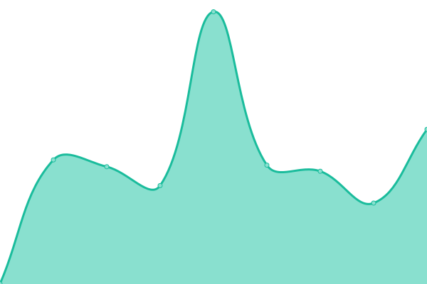
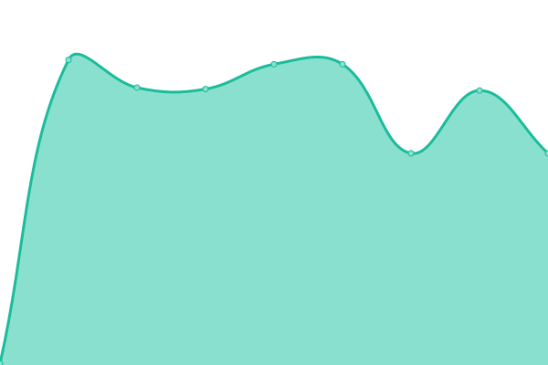

# [📈 Live Status](https://VicmapSpatialServices.github.io/vicmap-upptime): <!--live status--> **🟧 Partial outage**

This repository contains the open-source uptime monitor and status page for [VicmapSpatialServices](https://VicmapSpatialServices.github.io/vicmap-upptime), powered by [Upptime](https://github.com/upptime/upptime).

With [Upptime](https://upptime.js.org), you can get your own unlimited and free uptime monitor and status page, powered entirely by a GitHub repository. We use [Issues](https://github.com/VicmapSpatialServices/vicmap-upptime/issues) as incident reports, [Actions](https://github.com/VicmapSpatialServices/vicmap-upptime/actions) as uptime monitors, and [Pages](https://VicmapSpatialServices.github.io/vicmap-upptime) for the status page.

<!--start: status pages-->
<!-- This summary is generated by Upptime (https://github.com/upptime/upptime) -->
<!-- Do not edit this manually, your changes will be overwritten -->
<!-- prettier-ignore -->
| URL | Status | History | Response Time | Uptime |
| --- | ------ | ------- | ------------- | ------ |
|  [AGOL-Vicmap_Address-FS](https://services-ap1.arcgis.com/P744lA0wf4LlBZ84/arcgis/rest/services/Vicmap_Address/FeatureServer/0/query?where=1%3D1&resultRecordCount=1&sqlFormat=none&f=pjson) | 🟩 Up | [agol-vicmap-address-fs.yml](https://github.com/VicmapSpatialServices/vicmap-upptime/commits/HEAD/history/agol-vicmap-address-fs.yml) | 

 780ms
     
 | 

<a href="https://VicmapSpatialServices.github.io/vicmap-upptime/history/agol-vicmap-address-fs">100.00%</a>
    

|  [AGOL-Vicmap_Admin-FS](https://services-ap1.arcgis.com/P744lA0wf4LlBZ84/arcgis/rest/services/Vicmap_Admin/FeatureServer/0/query?where=1%3D1&resultRecordCount=1&sqlFormat=none&f=pjson) | 🟩 Up | [agol-vicmap-admin-fs.yml](https://github.com/VicmapSpatialServices/vicmap-upptime/commits/HEAD/history/agol-vicmap-admin-fs.yml) | 

 944ms
     
 | 

<a href="https://VicmapSpatialServices.github.io/vicmap-upptime/history/agol-vicmap-admin-fs">99.80%</a>
    

|  [AGOL-Vicmap_Crown_Land_Tenure-FS](https://services-ap1.arcgis.com/P744lA0wf4LlBZ84/arcgis/rest/services/Vicmap_Crown_Land_Tenure/FeatureServer/0/query?where=1%3D1&resultRecordCount=1&sqlFormat=none&f=pjson) | 🟩 Up | [agol-vicmap-crown-land-tenure-fs.yml](https://github.com/VicmapSpatialServices/vicmap-upptime/commits/HEAD/history/agol-vicmap-crown-land-tenure-fs.yml) | 

 928ms
     
 | 

<a href="https://VicmapSpatialServices.github.io/vicmap-upptime/history/agol-vicmap-crown-land-tenure-fs">100.00%</a>
    

|  [AGOL-Vicmap_Elevation_METRO_1_to_5_metre-FS](https://services-ap1.arcgis.com/P744lA0wf4LlBZ84/arcgis/rest/services/Vicmap_Elevation_METRO_1_to_5_metre/FeatureServer/0/query?where=1%3D1&resultRecordCount=1&sqlFormat=none&f=pjson) | 🟩 Up | [agol-vicmap-elevation-metro-1-to-5-metre-fs.yml](https://github.com/VicmapSpatialServices/vicmap-upptime/commits/HEAD/history/agol-vicmap-elevation-metro-1-to-5-metre-fs.yml) | 

 922ms
     
 | 

<a href="https://VicmapSpatialServices.github.io/vicmap-upptime/history/agol-vicmap-elevation-metro-1-to-5-metre-fs">100.00%</a>
    

|  [AGOL-Vicmap_Elevation_STATEWIDE_10_to_20_metre-FS](https://services-ap1.arcgis.com/P744lA0wf4LlBZ84/arcgis/rest/services/Vicmap_Elevation_STATEWIDE_10_to_20_metre/FeatureServer/0/query?where=1%3D1&resultRecordCount=1&sqlFormat=none&f=pjson) | 🟩 Up | [agol-vicmap-elevation-statewide-10-to-20-metre-fs.yml](https://github.com/VicmapSpatialServices/vicmap-upptime/commits/HEAD/history/agol-vicmap-elevation-statewide-10-to-20-metre-fs.yml) | 

 766ms
     
 | 

<a href="https://VicmapSpatialServices.github.io/vicmap-upptime/history/agol-vicmap-elevation-statewide-10-to-20-metre-fs">100.00%</a>
    

|  [AGOL-Vicmap_Features_of_Interest-FS](https://services-ap1.arcgis.com/P744lA0wf4LlBZ84/arcgis/rest/services/Vicmap_Features_of_Interest/FeatureServer/0/query?where=1%3D1&resultRecordCount=1&sqlFormat=none&f=pjson) | 🟩 Up | [agol-vicmap-features-of-interest-fs.yml](https://github.com/VicmapSpatialServices/vicmap-upptime/commits/HEAD/history/agol-vicmap-features-of-interest-fs.yml) | 

 704ms
     
 | 

<a href="https://VicmapSpatialServices.github.io/vicmap-upptime/history/agol-vicmap-features-of-interest-fs">90.15%</a>
    

|  [AGOL-Vicmap_Geomark-FS](https://services-ap1.arcgis.com/P744lA0wf4LlBZ84/arcgis/rest/services/Vicmap_Geomark/FeatureServer/1/query?where=1%3D1&resultRecordCount=1&sqlFormat=none&f=pjson) | 🟩 Up | [agol-vicmap-geomark-fs.yml](https://github.com/VicmapSpatialServices/vicmap-upptime/commits/HEAD/history/agol-vicmap-geomark-fs.yml) | 

 762ms
     
 | 

<a href="https://VicmapSpatialServices.github.io/vicmap-upptime/history/agol-vicmap-geomark-fs">100.00%</a>
    

|  [AGOL-Vicmap_Hydro-FS](https://services-ap1.arcgis.com/P744lA0wf4LlBZ84/arcgis/rest/services/Vicmap_Hydro/FeatureServer/1/query?where=1%3D1&resultRecordCount=1&sqlFormat=none&f=pjson) | 🟩 Up | [agol-vicmap-hydro-fs.yml](https://github.com/VicmapSpatialServices/vicmap-upptime/commits/HEAD/history/agol-vicmap-hydro-fs.yml) | 

 855ms
     
 | 

<a href="https://VicmapSpatialServices.github.io/vicmap-upptime/history/agol-vicmap-hydro-fs">100.00%</a>
    

|  [AGOL-Vicmap_Index-FS](https://services-ap1.arcgis.com/P744lA0wf4LlBZ84/arcgis/rest/services/Vicmap_Index/FeatureServer/1/query?where=1%3D1&resultRecordCount=1&sqlFormat=none&f=pjson) | 🟩 Up | [agol-vicmap-index-fs.yml](https://github.com/VicmapSpatialServices/vicmap-upptime/commits/HEAD/history/agol-vicmap-index-fs.yml) | 

 895ms
     
 | 

<a href="https://VicmapSpatialServices.github.io/vicmap-upptime/history/agol-vicmap-index-fs">90.17%</a>
    

|  [AGOL-Vicmap_Lite-FS](https://services-ap1.arcgis.com/P744lA0wf4LlBZ84/arcgis/rest/services/Vicmap_Lite/FeatureServer/0/query?where=1%3D1&resultRecordCount=1&sqlFormat=none&f=pjson) | 🟩 Up | [agol-vicmap-lite-fs.yml](https://github.com/VicmapSpatialServices/vicmap-upptime/commits/HEAD/history/agol-vicmap-lite-fs.yml) | 

 658ms
     
 | 

<a href="https://VicmapSpatialServices.github.io/vicmap-upptime/history/agol-vicmap-lite-fs">90.19%</a>
    

|  [AGOL-Vicmap_Parcel-FS](https://services-ap1.arcgis.com/P744lA0wf4LlBZ84/arcgis/rest/services/Vicmap_Parcel/FeatureServer/0/query?where=1%3D1&resultRecordCount=1&sqlFormat=none&f=pjson) | 🟩 Up | [agol-vicmap-parcel-fs.yml](https://github.com/VicmapSpatialServices/vicmap-upptime/commits/HEAD/history/agol-vicmap-parcel-fs.yml) | 

 560ms
     
 | 

<a href="https://VicmapSpatialServices.github.io/vicmap-upptime/history/agol-vicmap-parcel-fs">100.00%</a>
    

|  [AGOL-Vicmap_Planning-FS](https://services-ap1.arcgis.com/P744lA0wf4LlBZ84/arcgis/rest/services/Vicmap_Planning/FeatureServer/0/query?where=1%3D1&resultRecordCount=1&sqlFormat=none&f=pjson) | 🟩 Up | [agol-vicmap-planning-fs.yml](https://github.com/VicmapSpatialServices/vicmap-upptime/commits/HEAD/history/agol-vicmap-planning-fs.yml) | 

 639ms
     
 | 

<a href="https://VicmapSpatialServices.github.io/vicmap-upptime/history/agol-vicmap-planning-fs">90.21%</a>
    

|  [AGOL-Vicmap_Position-FS](https://services-ap1.arcgis.com/P744lA0wf4LlBZ84/arcgis/rest/services/Vicmap_Position/FeatureServer/0/query?where=1%3D1&resultRecordCount=1&sqlFormat=none&f=pjson) | 🟩 Up | [agol-vicmap-position-fs.yml](https://github.com/VicmapSpatialServices/vicmap-upptime/commits/HEAD/history/agol-vicmap-position-fs.yml) | 

 791ms
     
 | 

<a href="https://VicmapSpatialServices.github.io/vicmap-upptime/history/agol-vicmap-position-fs">100.00%</a>
    

|  [AGOL-Vicmap_Property-FS](https://services-ap1.arcgis.com/P744lA0wf4LlBZ84/arcgis/rest/services/Vicmap_Property/FeatureServer/0/query?where=1%3D1&resultRecordCount=1&sqlFormat=none&f=pjson) | 🟩 Up | [agol-vicmap-property-fs.yml](https://github.com/VicmapSpatialServices/vicmap-upptime/commits/HEAD/history/agol-vicmap-property-fs.yml) | 

 487ms
     
 | 

<a href="https://VicmapSpatialServices.github.io/vicmap-upptime/history/agol-vicmap-property-fs">100.00%</a>
    

|  [AGOL-Vicmap_Property_Easements_and_Road_Casements-FS](https://services-ap1.arcgis.com/P744lA0wf4LlBZ84/arcgis/rest/services/Vicmap_Property_Easements_and_Road_Casements/FeatureServer/0/query?where=1%3D1&resultRecordCount=1&sqlFormat=none&f=pjson) | 🟩 Up | [agol-vicmap-property-easements-and-road-casements-fs.yml](https://github.com/VicmapSpatialServices/vicmap-upptime/commits/HEAD/history/agol-vicmap-property-easements-and-road-casements-fs.yml) | 

 632ms
     
 | 

<a href="https://VicmapSpatialServices.github.io/vicmap-upptime/history/agol-vicmap-property-easements-and-road-casements-fs">100.00%</a>
    

|  [AGOL-Vicmap_Transport-FS](https://services-ap1.arcgis.com/P744lA0wf4LlBZ84/arcgis/rest/services/Vicmap_Transport/FeatureServer/0/query?where=1%3D1&resultRecordCount=1&sqlFormat=none&f=pjson) | 🟩 Up | [agol-vicmap-transport-fs.yml](https://github.com/VicmapSpatialServices/vicmap-upptime/commits/HEAD/history/agol-vicmap-transport-fs.yml) | 

 792ms
     
 | 

<a href="https://VicmapSpatialServices.github.io/vicmap-upptime/history/agol-vicmap-transport-fs">100.00%</a>
    

|  [AGOL- Vicmap_Vegetation_Tree_Density_GDA2020-MS](https://tiles.arcgis.com/tiles/GB33F62SbDxJjwEL/arcgis/rest/services/Vicmap_Vegetation_Tree_Density_GDA2020/MapServer/0?f=pjson) | 🟩 Up | [agol-vicmap-vegetation-tree-density-gda-2020-ms.yml](https://github.com/VicmapSpatialServices/vicmap-upptime/commits/HEAD/history/agol-vicmap-vegetation-tree-density-gda-2020-ms.yml) | 

 184ms
     
 | 

<a href="https://VicmapSpatialServices.github.io/vicmap-upptime/history/agol-vicmap-vegetation-tree-density-gda-2020-ms">100.00%</a>
    

|  [AGOL-Vicmap_Veg_Tree_Density-MS](https://tiles.arcgis.com/tiles/GB33F62SbDxJjwEL/arcgis/rest/services/Vicmap_Veg_Tree_Density/MapServer/0?f=pjson) | 🟩 Up | [agol-vicmap-veg-tree-density-ms.yml](https://github.com/VicmapSpatialServices/vicmap-upptime/commits/HEAD/history/agol-vicmap-veg-tree-density-ms.yml) | 

 87ms
     
 | 

<a href="https://VicmapSpatialServices.github.io/vicmap-upptime/history/agol-vicmap-veg-tree-density-ms">100.00%</a>
    

|  [AGOL-Vicmap_Veg_Tree_Density-VTS](https://tiles.arcgis.com/tiles/GB33F62SbDxJjwEL/arcgis/rest/services/Vicmap_Vegetation_Tree_Density/VectorTileServer) | 🟩 Up | [agol-vicmap-veg-tree-density-vts.yml](https://github.com/VicmapSpatialServices/vicmap-upptime/commits/HEAD/history/agol-vicmap-veg-tree-density-vts.yml) | 

 117ms
     
 | 

<a href="https://VicmapSpatialServices.github.io/vicmap-upptime/history/agol-vicmap-veg-tree-density-vts">100.00%</a>
    

|  [AGOL-Vicmap_Vegetation_Tree_Extent_GDA2020-MS](https://tiles.arcgis.com/tiles/GB33F62SbDxJjwEL/arcgis/rest/services/Vicmap_Vegetation_Tree_Extent_GDA2020/MapServer/0?f=pjson) | 🟩 Up | [agol-vicmap-vegetation-tree-extent-gda-2020-ms.yml](https://github.com/VicmapSpatialServices/vicmap-upptime/commits/HEAD/history/agol-vicmap-vegetation-tree-extent-gda-2020-ms.yml) | 

 95ms
     
 | 

<a href="https://VicmapSpatialServices.github.io/vicmap-upptime/history/agol-vicmap-vegetation-tree-extent-gda-2020-ms">100.00%</a>
    

|  [AGOL-Vicmap_Vegetation_Tree_Extent-MS](https://tiles.arcgis.com/tiles/GB33F62SbDxJjwEL/arcgis/rest/services/Vicmap_Vegetation_Tree_Extent/MapServer/0?f=pjson) | 🟩 Up | [agol-vicmap-vegetation-tree-extent-ms.yml](https://github.com/VicmapSpatialServices/vicmap-upptime/commits/HEAD/history/agol-vicmap-vegetation-tree-extent-ms.yml) | 

 72ms
     
 | 

<a href="https://VicmapSpatialServices.github.io/vicmap-upptime/history/agol-vicmap-vegetation-tree-extent-ms">100.00%</a>
    

|  [AGOL-Vicmap_Vegetation_Tree_Urban_Tiled-MS](https://tiles.arcgis.com/tiles/GB33F62SbDxJjwEL/arcgis/rest/services/Vicmap_Vegetation_Tree_Urban_Tiled/MapServer/0?f=pjson) | 🟩 Up | [agol-vicmap-vegetation-tree-urban-tiled-ms.yml](https://github.com/VicmapSpatialServices/vicmap-upptime/commits/HEAD/history/agol-vicmap-vegetation-tree-urban-tiled-ms.yml) | 

 89ms
     
 | 

<a href="https://VicmapSpatialServices.github.io/vicmap-upptime/history/agol-vicmap-vegetation-tree-urban-tiled-ms">100.00%</a>
    

|  [AGOL-Vicmap_Vegetation_Tree_Urba-MS](https://tiles.arcgis.com/tiles/GB33F62SbDxJjwEL/arcgis/rest/services/Vicmap_Vegetation_Tree_Urba/MapServer/0?f=pjson) | 🟩 Up | [agol-vicmap-vegetation-tree-urba-ms.yml](https://github.com/VicmapSpatialServices/vicmap-upptime/commits/HEAD/history/agol-vicmap-vegetation-tree-urba-ms.yml) | 

 80ms
     
 | 

<a href="https://VicmapSpatialServices.github.io/vicmap-upptime/history/agol-vicmap-vegetation-tree-urba-ms">100.00%</a>
    

|  [AGOL- Vicmap_Vegetation_Tree_Urban-FS](https://services-ap1.arcgis.com/P744lA0wf4LlBZ84/arcgis/rest/services/Vicmap_Vegetation_Tree_Urban/FeatureServer/0/query?where=1%3D1&resultRecordCount=1&sqlFormat=none&f=pjson) | 🟩 Up | [agol-vicmap-vegetation-tree-urban-fs.yml](https://github.com/VicmapSpatialServices/vicmap-upptime/commits/HEAD/history/agol-vicmap-vegetation-tree-urban-fs.yml) | 

 975ms
     
 | 

<a href="https://VicmapSpatialServices.github.io/vicmap-upptime/history/agol-vicmap-vegetation-tree-urban-fs">100.00%</a>
    

|  [AGOL-Vicmap_Property_Address-FS](https://services-ap1.arcgis.com/P744lA0wf4LlBZ84/arcgis/rest/services/Vicmap_Property_Address/FeatureServer/0/query?where=1%3D1&resultRecordCount=1&sqlFormat=none&f=pjson) | 🟩 Up | [agol-vicmap-property-address-fs.yml](https://github.com/VicmapSpatialServices/vicmap-upptime/commits/HEAD/history/agol-vicmap-property-address-fs.yml) | 

 996ms
     
 | 

<a href="https://VicmapSpatialServices.github.io/vicmap-upptime/history/agol-vicmap-property-address-fs">100.00%</a>
    

|  [AGOL-Vicmap_Parcel_Property_Aspatial_Table-FS](https://services-ap1.arcgis.com/P744lA0wf4LlBZ84/arcgis/rest/services/Vicmap_Parcel_Property_Aspatial_Table/FeatureServer/0/query?where=1%3D1&resultRecordCount=1&sqlFormat=none&f=pjson) | 🟩 Up | [agol-vicmap-parcel-property-aspatial-table-fs.yml](https://github.com/VicmapSpatialServices/vicmap-upptime/commits/HEAD/history/agol-vicmap-parcel-property-aspatial-table-fs.yml) | 

 821ms
     
 | 

<a href="https://VicmapSpatialServices.github.io/vicmap-upptime/history/agol-vicmap-parcel-property-aspatial-table-fs">100.00%</a>
    

|  [AGE_ISD- Vicmap_Vegetation_Tree_Urban-MS](https://enterprise.mapshare.vic.gov.au/server/rest/services/Vicmap_Vegetation_Tree_Urban/MapServer) | 🟩 Up | [age-isd-vicmap-vegetation-tree-urban-ms.yml](https://github.com/VicmapSpatialServices/vicmap-upptime/commits/HEAD/history/age-isd-vicmap-vegetation-tree-urban-ms.yml) | 

 958ms
     
 | 

<a href="https://VicmapSpatialServices.github.io/vicmap-upptime/history/age-isd-vicmap-vegetation-tree-urban-ms">60.18%</a>
    

|  [AGS_GIS- Vicmap_Parcel_Property_Aspatial_Table-MS](https://vicmap.land.vic.gov.au/agsgis/rest/services/vicmap/Vicmap_Parcel_Property_Aspatial_Table/MapServer/0/query?where=1%3D1&resultRecordCount=1) | 🟩 Up | [ags-gis-vicmap-parcel-property-aspatial-table-ms.yml](https://github.com/VicmapSpatialServices/vicmap-upptime/commits/HEAD/history/ags-gis-vicmap-parcel-property-aspatial-table-ms.yml) | 

 878ms
     
 | 

<a href="https://VicmapSpatialServices.github.io/vicmap-upptime/history/ags-gis-vicmap-parcel-property-aspatial-table-ms">100.00%</a>
    

|  [AGS_IMAGE-vicmap_dem10m_v5m_ahd_epsg7844-IS](https://vicmap.land.vic.gov.au/agsimage/rest/services/elevation/vicmap_dem10m_v5m_ahd_epsg7844/ImageServer/query?where=1%3D1&resultRecordCount=1) | 🟩 Up | [ags-image-vicmap-dem10m-v5m-ahd-epsg7844-is.yml](https://github.com/VicmapSpatialServices/vicmap-upptime/commits/HEAD/history/ags-image-vicmap-dem10m-v5m-ahd-epsg7844-is.yml) | 

 218ms
     
 | 

<a href="https://VicmapSpatialServices.github.io/vicmap-upptime/history/ags-image-vicmap-dem10m-v5m-ahd-epsg7844-is">100.00%</a>
    

|  [AGE-Vicmap_Vector_Tile_Basemap_Colour_WM_Hosted](https://vicmap.land.vic.gov.au/hosting/rest/services/Hosted/Vicmap_Vector_Tile_Basemap_Colour_WM_Hosted/VectorTileServer) | 🟥 Down | [age-vicmap-vector-tile-basemap-colour-wm-hosted.yml](https://github.com/VicmapSpatialServices/vicmap-upptime/commits/HEAD/history/age-vicmap-vector-tile-basemap-colour-wm-hosted.yml) | 

 181ms
     
 | 

<a href="https://VicmapSpatialServices.github.io/vicmap-upptime/history/age-vicmap-vector-tile-basemap-colour-wm-hosted">85.00%</a>
    

|  [AGE-Vicmap_Vector_Tile_Basemap_DarkGrey_WM_Hosted](https://vicmap.land.vic.gov.au/hosting/rest/services/Hosted/Vicmap_Vector_Tile_Basemap_DarkGrey_WM_Hosted/VectorTileServer) | 🟥 Down | [age-vicmap-vector-tile-basemap-dark-grey-wm-hosted.yml](https://github.com/VicmapSpatialServices/vicmap-upptime/commits/HEAD/history/age-vicmap-vector-tile-basemap-dark-grey-wm-hosted.yml) | 

 198ms
     
 | 

<a href="https://VicmapSpatialServices.github.io/vicmap-upptime/history/age-vicmap-vector-tile-basemap-dark-grey-wm-hosted">85.17%</a>
    

|  [AGE-Vicmap_Vector_Tile_Basemap_Greyscale_WM_Hosted](https://vicmap.land.vic.gov.au/hosting/rest/services/Hosted/Vicmap_Vector_Tile_Basemap_Greyscale_WM_Hosted/VectorTileServer) | 🟥 Down | [age-vicmap-vector-tile-basemap-greyscale-wm-hosted.yml](https://github.com/VicmapSpatialServices/vicmap-upptime/commits/HEAD/history/age-vicmap-vector-tile-basemap-greyscale-wm-hosted.yml) | 

 2282ms
     
 | 

<a href="https://VicmapSpatialServices.github.io/vicmap-upptime/history/age-vicmap-vector-tile-basemap-greyscale-wm-hosted">85.17%</a>
    

|  [AGE-Vicmap_Vector_Tile_Basemap_Hybrid_WM_Hosted](https://vicmap.land.vic.gov.au/hosting/rest/services/Hosted/Vicmap_Vector_Tile_Basemap_Hybrid_WM_Hosted/VectorTileServer) | 🟥 Down | [age-vicmap-vector-tile-basemap-hybrid-wm-hosted.yml](https://github.com/VicmapSpatialServices/vicmap-upptime/commits/HEAD/history/age-vicmap-vector-tile-basemap-hybrid-wm-hosted.yml) | 

 180ms
     
 | 

<a href="https://VicmapSpatialServices.github.io/vicmap-upptime/history/age-vicmap-vector-tile-basemap-hybrid-wm-hosted">85.18%</a>
    

|  [AGE-Vicmap_Vector_Tile_Basemap_Overlay_WM_Hosted](https://vicmap.land.vic.gov.au/hosting/rest/services/Hosted/Vicmap_Vector_Tile_Basemap_Overlay_WM_Hosted/VectorTileServer) | 🟥 Down | [age-vicmap-vector-tile-basemap-overlay-wm-hosted.yml](https://github.com/VicmapSpatialServices/vicmap-upptime/commits/HEAD/history/age-vicmap-vector-tile-basemap-overlay-wm-hosted.yml) | 

 178ms
     
 | 

<a href="https://VicmapSpatialServices.github.io/vicmap-upptime/history/age-vicmap-vector-tile-basemap-overlay-wm-hosted">85.18%</a>
    

|  [AGE- Vicmap_1m_DEM_Footprints-FS](https://vicmap.land.vic.gov.au/hosting/rest/services/elevation/Vicmap_1m_DEM_Footprints/FeatureServer/0/query?where=1%3D1&resultRecordCount=1) | 🟥 Down | [age-vicmap-1m-dem-footprints-fs.yml](https://github.com/VicmapSpatialServices/vicmap-upptime/commits/HEAD/history/age-vicmap-1m-dem-footprints-fs.yml) | 

 483ms
     
 | 

<a href="https://VicmapSpatialServices.github.io/vicmap-upptime/history/age-vicmap-1m-dem-footprints-fs">95.65%</a>
    

|  [AGE-Vicmap_Address-MS](https://vicmap.land.vic.gov.au/hosting/rest/services/vicmap/Vicmap_Address/MapServer/0/query?where=1%3D1&resultRecordCount=1) | 🟥 Down | [age-vicmap-address-ms.yml](https://github.com/VicmapSpatialServices/vicmap-upptime/commits/HEAD/history/age-vicmap-address-ms.yml) | 

 327ms
     
 | 

<a href="https://VicmapSpatialServices.github.io/vicmap-upptime/history/age-vicmap-address-ms">97.36%</a>
    

|  [AGE-Vicmap_Admin-MS](https://vicmap.land.vic.gov.au/hosting/rest/services/vicmap/Vicmap_Admin/MapServer/0/query?where=1%3D1&resultRecordCount=1) | 🟥 Down | [age-vicmap-admin-ms.yml](https://github.com/VicmapSpatialServices/vicmap-upptime/commits/HEAD/history/age-vicmap-admin-ms.yml) | 

 815ms
     
 | 

<a href="https://VicmapSpatialServices.github.io/vicmap-upptime/history/age-vicmap-admin-ms">96.70%</a>
    

|  [AGE-Vicmap_Crown_Land_Tenure-MS](https://vicmap.land.vic.gov.au/hosting/rest/services/vicmap/Vicmap_Crown_Land_Tenure/MapServer/0/query?where=1%3D1&resultRecordCount=1) | 🟩 Up | [age-vicmap-crown-land-tenure-ms.yml](https://github.com/VicmapSpatialServices/vicmap-upptime/commits/HEAD/history/age-vicmap-crown-land-tenure-ms.yml) | 

 375ms
     
 | 

<a href="https://VicmapSpatialServices.github.io/vicmap-upptime/history/age-vicmap-crown-land-tenure-ms">97.75%</a>
    

|  [AGE-Vicmap_Elevation_METRO_1_to_5_metre-MS](https://vicmap.land.vic.gov.au/hosting/rest/services/vicmap/Vicmap_Elevation_METRO_1_to_5_metre/MapServer/0/query?where=1%3D1&resultRecordCount=1) | 🟩 Up | [age-vicmap-elevation-metro-1-to-5-metre-ms.yml](https://github.com/VicmapSpatialServices/vicmap-upptime/commits/HEAD/history/age-vicmap-elevation-metro-1-to-5-metre-ms.yml) | 

 350ms
     
 | 

<a href="https://VicmapSpatialServices.github.io/vicmap-upptime/history/age-vicmap-elevation-metro-1-to-5-metre-ms">97.78%</a>
    

|  [AGE-Vicmap_Elevation_STATEWIDE_10_to_20_metre-MS](https://vicmap.land.vic.gov.au/hosting/rest/services/vicmap/Vicmap_Elevation_STATEWIDE_10_to_20_metre/MapServer/0/query?where=1%3D1&resultRecordCount=1) | 🟩 Up | [age-vicmap-elevation-statewide-10-to-20-metre-ms.yml](https://github.com/VicmapSpatialServices/vicmap-upptime/commits/HEAD/history/age-vicmap-elevation-statewide-10-to-20-metre-ms.yml) | 

 521ms
     
 | 

<a href="https://VicmapSpatialServices.github.io/vicmap-upptime/history/age-vicmap-elevation-statewide-10-to-20-metre-ms">98.20%</a>
    

|  [AGE-Vicmap_Features_of_Interest-MS](https://vicmap.land.vic.gov.au/hosting/rest/services/vicmap/Vicmap_Features_of_Interest/MapServer/0/query?where=1%3D1&resultRecordCount=1) | 🟩 Up | [age-vicmap-features-of-interest-ms.yml](https://github.com/VicmapSpatialServices/vicmap-upptime/commits/HEAD/history/age-vicmap-features-of-interest-ms.yml) | 

 472ms
     
 | 

<a href="https://VicmapSpatialServices.github.io/vicmap-upptime/history/age-vicmap-features-of-interest-ms">98.38%</a>
    

|  [AGE-Vicmap_Geomark-MS](https://vicmap.land.vic.gov.au/hosting/rest/services/vicmap/Vicmap_Geomark/MapServer/0/query?where=1%3D1&resultRecordCount=1) | 🟩 Up | [age-vicmap-geomark-ms.yml](https://github.com/VicmapSpatialServices/vicmap-upptime/commits/HEAD/history/age-vicmap-geomark-ms.yml) | 

 345ms
     
 | 

<a href="https://VicmapSpatialServices.github.io/vicmap-upptime/history/age-vicmap-geomark-ms">98.69%</a>
    

|  [AGE-Vicmap_Hydro-MS](https://vicmap.land.vic.gov.au/hosting/rest/services/vicmap/Vicmap_Hydro/MapServer/0/query?where=1%3D1&resultRecordCount=1) | 🟩 Up | [age-vicmap-hydro-ms.yml](https://github.com/VicmapSpatialServices/vicmap-upptime/commits/HEAD/history/age-vicmap-hydro-ms.yml) | 

 201ms
     
 | 

<a href="https://VicmapSpatialServices.github.io/vicmap-upptime/history/age-vicmap-hydro-ms">98.69%</a>
    

|  [AGE-Vicmap_Index-MS](https://vicmap.land.vic.gov.au/hosting/rest/services/vicmap/Vicmap_Index/MapServer/0/query?where=1%3D1&resultRecordCount=1) | 🟩 Up | [age-vicmap-index-ms.yml](https://github.com/VicmapSpatialServices/vicmap-upptime/commits/HEAD/history/age-vicmap-index-ms.yml) | 

 327ms
     
 | 

<a href="https://VicmapSpatialServices.github.io/vicmap-upptime/history/age-vicmap-index-ms">84.92%</a>
    

|  [AGE-Vicmap_Lite-MS](https://vicmap.land.vic.gov.au/hosting/rest/services/vicmap/Vicmap_Lite/MapServer/0/query?where=1%3D1&resultRecordCount=1) | 🟩 Up | [age-vicmap-lite-ms.yml](https://github.com/VicmapSpatialServices/vicmap-upptime/commits/HEAD/history/age-vicmap-lite-ms.yml) | 

 1868ms
     
 | 

<a href="https://VicmapSpatialServices.github.io/vicmap-upptime/history/age-vicmap-lite-ms">84.92%</a>
    

|  [AGE-Vicmap_Parcel-MS](https://vicmap.land.vic.gov.au/hosting/rest/services/vicmap/Vicmap_Parcel/MapServer/0/query?where=1%3D1&resultRecordCount=1) | 🟩 Up | [age-vicmap-parcel-ms.yml](https://github.com/VicmapSpatialServices/vicmap-upptime/commits/HEAD/history/age-vicmap-parcel-ms.yml) | 

 346ms
     
 | 

<a href="https://VicmapSpatialServices.github.io/vicmap-upptime/history/age-vicmap-parcel-ms">84.43%</a>
    

|  [AGE-Vicmap_Planning-MS](https://vicmap.land.vic.gov.au/hosting/rest/services/vicmap/Vicmap_Planning/MapServer/0/query?where=1%3D1) | 🟩 Up | [age-vicmap-planning-ms.yml](https://github.com/VicmapSpatialServices/vicmap-upptime/commits/HEAD/history/age-vicmap-planning-ms.yml) | 

 408ms
     
 | 

<a href="https://VicmapSpatialServices.github.io/vicmap-upptime/history/age-vicmap-planning-ms">84.43%</a>
    

|  [AGE-Vicmap_Position-MS](https://vicmap.land.vic.gov.au/hosting/rest/services/vicmap/Vicmap_Position/MapServer/0/query?where=1%3D1) | 🟩 Up | [age-vicmap-position-ms.yml](https://github.com/VicmapSpatialServices/vicmap-upptime/commits/HEAD/history/age-vicmap-position-ms.yml) | 

 1028ms
     
 | 

<a href="https://VicmapSpatialServices.github.io/vicmap-upptime/history/age-vicmap-position-ms">84.43%</a>
    

|  [AGE-Vicmap_Property_Address-MS](https://vicmap.land.vic.gov.au/hosting/rest/services/vicmap/Vicmap_Property_Address/MapServer/0/query?where=1%3D1&resultRecordCount=1) | 🟩 Up | [age-vicmap-property-address-ms.yml](https://github.com/VicmapSpatialServices/vicmap-upptime/commits/HEAD/history/age-vicmap-property-address-ms.yml) | 

 273ms
     
 | 

<a href="https://VicmapSpatialServices.github.io/vicmap-upptime/history/age-vicmap-property-address-ms">84.72%</a>
    

|  [AGE-Vicmap_Property_Easements_and_Road_Casements-M](https://vicmap.land.vic.gov.au/hosting/rest/services/vicmap/Vicmap_Property_Easements_and_Road_Casements/MapServer/0/query?where=1%3D1&resultRecordCount=1) | 🟩 Up | [age-vicmap-property-easements-and-road-casements-m.yml](https://github.com/VicmapSpatialServices/vicmap-upptime/commits/HEAD/history/age-vicmap-property-easements-and-road-casements-m.yml) | 

 315ms
     
 | 

<a href="https://VicmapSpatialServices.github.io/vicmap-upptime/history/age-vicmap-property-easements-and-road-casements-m">85.77%</a>
    

|  [AGE-Vicmap_Property-MS](https://vicmap.land.vic.gov.au/hosting/rest/services/vicmap/Vicmap_Property/MapServer/0/query?where=1%3D1&resultRecordCount=1) | 🟩 Up | [age-vicmap-property-ms.yml](https://github.com/VicmapSpatialServices/vicmap-upptime/commits/HEAD/history/age-vicmap-property-ms.yml) | 

 293ms
     
 | 

<a href="https://VicmapSpatialServices.github.io/vicmap-upptime/history/age-vicmap-property-ms">100.00%</a>
    

|  [AGE-Vicmap_Transport-MS](https://vicmap.land.vic.gov.au/hosting/rest/services/vicmap/Vicmap_Transport/MapServer/0/query?where=1%3D1&resultRecordCount=1) | 🟩 Up | [age-vicmap-transport-ms.yml](https://github.com/VicmapSpatialServices/vicmap-upptime/commits/HEAD/history/age-vicmap-transport-ms.yml) | 

 570ms
     
 | 

<a href="https://VicmapSpatialServices.github.io/vicmap-upptime/history/age-vicmap-transport-ms">100.00%</a>
    

|  AGS_IMAGE-Vicmap_1m_DEM_Terrain-IS | 🟩 Up | [ags-image-vicmap-1m-dem-terrain-is.yml](https://github.com/VicmapSpatialServices/vicmap-upptime/commits/HEAD/history/ags-image-vicmap-1m-dem-terrain-is.yml) | 

 239ms
     
 | 

<a href="https://VicmapSpatialServices.github.io/vicmap-upptime/history/ags-image-vicmap-1m-dem-terrain-is">100.00%</a>
    

|  AGS_IMAGE-Vicmap_1m_DEM_Hill_Shade-IS | 🟩 Up | [ags-image-vicmap-1m-dem-hill-shade-is.yml](https://github.com/VicmapSpatialServices/vicmap-upptime/commits/HEAD/history/ags-image-vicmap-1m-dem-hill-shade-is.yml) | 

 221ms
     
 | 

<a href="https://VicmapSpatialServices.github.io/vicmap-upptime/history/ags-image-vicmap-1m-dem-hill-shade-is">100.00%</a>
    

|  AGS_IMAGE-Vicmap_1m_DEM_Relief-IS | 🟩 Up | [ags-image-vicmap-1m-dem-relief-is.yml](https://github.com/VicmapSpatialServices/vicmap-upptime/commits/HEAD/history/ags-image-vicmap-1m-dem-relief-is.yml) | 

 219ms
     
 | 

<a href="https://VicmapSpatialServices.github.io/vicmap-upptime/history/ags-image-vicmap-1m-dem-relief-is">100.00%</a>
    

|  AGS_IMAGE-Vicmap_1m_DSM_LiDAR-IS | 🟩 Up | [ags-image-vicmap-1m-dsm-li-dar-is.yml](https://github.com/VicmapSpatialServices/vicmap-upptime/commits/HEAD/history/ags-image-vicmap-1m-dsm-li-dar-is.yml) | 

 216ms
     
 | 

<a href="https://VicmapSpatialServices.github.io/vicmap-upptime/history/ags-image-vicmap-1m-dsm-li-dar-is">100.00%</a>
    

|  AGS_GIS-stateview_imagery_mosaic_epsg3857-MS | 🟩 Up | [ags-gis-stateview-imagery-mosaic-epsg3857-ms.yml](https://github.com/VicmapSpatialServices/vicmap-upptime/commits/HEAD/history/ags-gis-stateview-imagery-mosaic-epsg3857-ms.yml) | 

 182ms
     
 | 

<a href="https://VicmapSpatialServices.github.io/vicmap-upptime/history/ags-gis-stateview-imagery-mosaic-epsg3857-ms">100.00%</a>
    

<!--end: status pages-->

[**Visit our status website →**](https://VicmapSpatialServices.github.io/vicmap-upptime)

## 📄 License

- Powered by: [Upptime](https://github.com/upptime/upptime)
- Code: [MIT](./LICENSE) © [Anand Chowdhary](https://anandchowdhary.com), supported by [Pabio](https://pabio.com)
- Data in the `./history` directory: [Open Database License](https://opendatacommons.org/licenses/odbl/1-0/)
