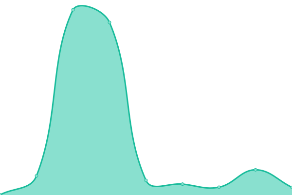

# [📈 Live Status](https://VicmapSpatialServices.github.io/vicmap-upptime): <!--live status--> **🟧 Partial outage**

This repository contains the open-source uptime monitor and status page for [VicmapSpatialServices](https://VicmapSpatialServices.github.io/vicmap-upptime), powered by [Upptime](https://github.com/upptime/upptime).

With [Upptime](https://upptime.js.org), you can get your own unlimited and free uptime monitor and status page, powered entirely by a GitHub repository. We use [Issues](https://github.com/VicmapSpatialServices/vicmap-upptime/issues) as incident reports, [Actions](https://github.com/VicmapSpatialServices/vicmap-upptime/actions) as uptime monitors, and [Pages](https://VicmapSpatialServices.github.io/vicmap-upptime) for the status page.

<!--start: status pages-->
<!-- This summary is generated by Upptime (https://github.com/upptime/upptime) -->
<!-- Do not edit this manually, your changes will be overwritten -->
<!-- prettier-ignore -->
| URL | Status | History | Response Time | Uptime |
| --- | ------ | ------- | ------------- | ------ |
|  [AGOL-Vicmap_Address-FS](https://services-ap1.arcgis.com/P744lA0wf4LlBZ84/arcgis/rest/services/Vicmap_Address/FeatureServer/0/query?where=1%3D1&resultRecordCount=1&sqlFormat=none&f=pjson) | 🟩 Up | [agol-vicmap-address-fs.yml](https://github.com/VicmapSpatialServices/vicmap-upptime/commits/HEAD/history/agol-vicmap-address-fs.yml) | 

 962ms
     
 | 

<a href="https://VicmapSpatialServices.github.io/vicmap-upptime/history/agol-vicmap-address-fs">100.00%</a>
    

|  [AGOL-Vicmap_Address-FS old](https://services6.arcgis.com/GB33F62SbDxJjwEL/arcgis/rest/services/Vicmap_Address/FeatureServer/0/query?where=1%3D1&resultRecordCount=1&sqlFormat=none&f=pjson) | 🟩 Up | [agol-vicmap-address-fs-old.yml](https://github.com/VicmapSpatialServices/vicmap-upptime/commits/HEAD/history/agol-vicmap-address-fs-old.yml) | 

 244ms
     
 | 

<a href="https://VicmapSpatialServices.github.io/vicmap-upptime/history/agol-vicmap-address-fs-old">100.00%</a>
    

|  [AGOL-Vicmap_Admin-FS](https://services-ap1.arcgis.com/P744lA0wf4LlBZ84/arcgis/rest/services/Vicmap_Admin/FeatureServer/0/query?where=1%3D1&resultRecordCount=1&sqlFormat=none&f=pjson) | 🟩 Up | [agol-vicmap-admin-fs.yml](https://github.com/VicmapSpatialServices/vicmap-upptime/commits/HEAD/history/agol-vicmap-admin-fs.yml) | 

 262ms
     
 | 

<a href="https://VicmapSpatialServices.github.io/vicmap-upptime/history/agol-vicmap-admin-fs">100.00%</a>
    

|  [AGOL-Vicmap_Crown_Land_Tenure-FS](https://services-ap1.arcgis.com/P744lA0wf4LlBZ84/arcgis/rest/services/Vicmap_Crown_Land_Tenure/FeatureServer/0/query?where=1%3D1&resultRecordCount=1&sqlFormat=none&f=pjson) | 🟩 Up | [agol-vicmap-crown-land-tenure-fs.yml](https://github.com/VicmapSpatialServices/vicmap-upptime/commits/HEAD/history/agol-vicmap-crown-land-tenure-fs.yml) | 

 633ms
     
 | 

<a href="https://VicmapSpatialServices.github.io/vicmap-upptime/history/agol-vicmap-crown-land-tenure-fs">100.00%</a>
    

|  [AGOL-Vicmap_Elevation_METRO_1_to_5_metre-FS](https://services-ap1.arcgis.com/P744lA0wf4LlBZ84/arcgis/rest/services/Vicmap_Elevation_METRO_1_to_5_metre/FeatureServer/0/query?where=1%3D1&resultRecordCount=1&sqlFormat=none&f=pjson) | 🟩 Up | [agol-vicmap-elevation-metro-1-to-5-metre-fs.yml](https://github.com/VicmapSpatialServices/vicmap-upptime/commits/HEAD/history/agol-vicmap-elevation-metro-1-to-5-metre-fs.yml) | 

 675ms
     
 | 

<a href="https://VicmapSpatialServices.github.io/vicmap-upptime/history/agol-vicmap-elevation-metro-1-to-5-metre-fs">100.00%</a>
    

|  [AGOL-Vicmap_Elevation_STATEWIDE_10_to_20_metre-FS](https://services-ap1.arcgis.com/P744lA0wf4LlBZ84/arcgis/rest/services/Vicmap_Elevation_STATEWIDE_10_to_20_metre/FeatureServer/0/query?where=1%3D1&resultRecordCount=1&sqlFormat=none&f=pjson) | 🟩 Up | [agol-vicmap-elevation-statewide-10-to-20-metre-fs.yml](https://github.com/VicmapSpatialServices/vicmap-upptime/commits/HEAD/history/agol-vicmap-elevation-statewide-10-to-20-metre-fs.yml) | 

 847ms
     
 | 

<a href="https://VicmapSpatialServices.github.io/vicmap-upptime/history/agol-vicmap-elevation-statewide-10-to-20-metre-fs">100.00%</a>
    

|  [AGOL-Vicmap_10m_DEM_Shaded_Relief](https://tiles-ap1.arcgis.com/P744lA0wf4LlBZ84/arcgis/rest/services/Vicmap_10m_DEM_Shaded_Relief/MapServer/) | 🟩 Up | [agol-vicmap-10m-dem-shaded-relief.yml](https://github.com/VicmapSpatialServices/vicmap-upptime/commits/HEAD/history/agol-vicmap-10m-dem-shaded-relief.yml) | 

 682ms
     
 | 

<a href="https://VicmapSpatialServices.github.io/vicmap-upptime/history/agol-vicmap-10m-dem-shaded-relief">100.00%</a>
    

|  [AGOL-Vicmap_Address-FS](https://vicmap.land.vic.gov.au/agsgis/rest/services/vicmap/Vicmap_Address/MapServer) | 🟩 Up | [agol-vicmap-address-fs.yml](https://github.com/VicmapSpatialServices/vicmap-upptime/commits/HEAD/history/agol-vicmap-address-fs.yml) | 

 962ms
     
 | 

<a href="https://VicmapSpatialServices.github.io/vicmap-upptime/history/agol-vicmap-address-fs">100.00%</a>
    

|  [AGOL-Vicmap_Features_of_Interest-FS](https://services-ap1.arcgis.com/P744lA0wf4LlBZ84/arcgis/rest/services/Vicmap_Features_of_Interest/FeatureServer/0/query?where=1%3D1&resultRecordCount=1&sqlFormat=none&f=pjson) | 🟩 Up | [agol-vicmap-features-of-interest-fs.yml](https://github.com/VicmapSpatialServices/vicmap-upptime/commits/HEAD/history/agol-vicmap-features-of-interest-fs.yml) | 

 841ms
     
 | 

<a href="https://VicmapSpatialServices.github.io/vicmap-upptime/history/agol-vicmap-features-of-interest-fs">100.00%</a>
    

|  [AGOL-Vicmap_Features_of_Interest-FS old](https://services6.arcgis.com/GB33F62SbDxJjwEL/arcgis/rest/services/Vicmap_Features_of_Interest/FeatureServer/0/query?where=1%3D1&resultRecordCount=1&sqlFormat=none&f=pjson) | 🟩 Up | [agol-vicmap-features-of-interest-fs-old.yml](https://github.com/VicmapSpatialServices/vicmap-upptime/commits/HEAD/history/agol-vicmap-features-of-interest-fs-old.yml) | 

 82ms
     
 | 

<a href="https://VicmapSpatialServices.github.io/vicmap-upptime/history/agol-vicmap-features-of-interest-fs-old">100.00%</a>
    

|  [AGOL-Vicmap_Geomark-FS](https://services-ap1.arcgis.com/P744lA0wf4LlBZ84/arcgis/rest/services/Vicmap_Geomark/FeatureServer/1/query?where=1%3D1&resultRecordCount=1&sqlFormat=none&f=pjson) | 🟩 Up | [agol-vicmap-geomark-fs.yml](https://github.com/VicmapSpatialServices/vicmap-upptime/commits/HEAD/history/agol-vicmap-geomark-fs.yml) | 

 775ms
     
 | 

<a href="https://VicmapSpatialServices.github.io/vicmap-upptime/history/agol-vicmap-geomark-fs">100.00%</a>
    

|  [AGOL-Vicmap_Hydro-FS](https://services-ap1.arcgis.com/P744lA0wf4LlBZ84/arcgis/rest/services/Vicmap_Hydro/FeatureServer/1/query?where=1%3D1&resultRecordCount=1&sqlFormat=none&f=pjson) | 🟩 Up | [agol-vicmap-hydro-fs.yml](https://github.com/VicmapSpatialServices/vicmap-upptime/commits/HEAD/history/agol-vicmap-hydro-fs.yml) | 

 604ms
     
 | 

<a href="https://VicmapSpatialServices.github.io/vicmap-upptime/history/agol-vicmap-hydro-fs">100.00%</a>
    

|  [AGOL-Vicmap_Index-FS](https://services-ap1.arcgis.com/P744lA0wf4LlBZ84/arcgis/rest/services/Vicmap_Index/FeatureServer/1/query?where=1%3D1&resultRecordCount=1&sqlFormat=none&f=pjson) | 🟩 Up | [agol-vicmap-index-fs.yml](https://github.com/VicmapSpatialServices/vicmap-upptime/commits/HEAD/history/agol-vicmap-index-fs.yml) | 

 1069ms
     
 | 

<a href="https://VicmapSpatialServices.github.io/vicmap-upptime/history/agol-vicmap-index-fs">100.00%</a>
    

|  [AGOL-Vicmap_Lite-FS](https://services-ap1.arcgis.com/P744lA0wf4LlBZ84/arcgis/rest/services/Vicmap_Lite/FeatureServer/0/query?where=1%3D1&resultRecordCount=1&sqlFormat=none&f=pjson) | 🟩 Up | [agol-vicmap-lite-fs.yml](https://github.com/VicmapSpatialServices/vicmap-upptime/commits/HEAD/history/agol-vicmap-lite-fs.yml) | 

 813ms
     
 | 

<a href="https://VicmapSpatialServices.github.io/vicmap-upptime/history/agol-vicmap-lite-fs">100.00%</a>
    

|  [AGOL-Vicmap_Lite-FS old](https://services6.arcgis.com/GB33F62SbDxJjwEL/arcgis/rest/services/Vicmap_Lite/FeatureServer/0/query?where=1%3D1&resultRecordCount=1&sqlFormat=none&f=pjson) | 🟥 Down | [agol-vicmap-lite-fs-old.yml](https://github.com/VicmapSpatialServices/vicmap-upptime/commits/HEAD/history/agol-vicmap-lite-fs-old.yml) | 

 112ms
     
 | 

<a href="https://VicmapSpatialServices.github.io/vicmap-upptime/history/agol-vicmap-lite-fs-old">100.00%</a>
    

|  [AGOL-Vicmap_Parcel-FS](https://services-ap1.arcgis.com/P744lA0wf4LlBZ84/arcgis/rest/services/Vicmap_Parcel/FeatureServer/0/query?where=1%3D1&resultRecordCount=1&sqlFormat=none&f=pjson) | 🟩 Up | [agol-vicmap-parcel-fs.yml](https://github.com/VicmapSpatialServices/vicmap-upptime/commits/HEAD/history/agol-vicmap-parcel-fs.yml) | 

 578ms
     
 | 

<a href="https://VicmapSpatialServices.github.io/vicmap-upptime/history/agol-vicmap-parcel-fs">100.00%</a>
    

|  [AGOL-Vicmap_Parcel-FS old](https://services6.arcgis.com/GB33F62SbDxJjwEL/arcgis/rest/services/Vicmap_Parcel/FeatureServer/0/query?where=1%3D1&resultRecordCount=1&sqlFormat=none&f=pjson) | 🟩 Up | [agol-vicmap-parcel-fs-old.yml](https://github.com/VicmapSpatialServices/vicmap-upptime/commits/HEAD/history/agol-vicmap-parcel-fs-old.yml) | 

 75ms
     
 | 

<a href="https://VicmapSpatialServices.github.io/vicmap-upptime/history/agol-vicmap-parcel-fs-old">100.00%</a>
    

|  [AGOL-Vicmap_Planning-FS](https://services-ap1.arcgis.com/P744lA0wf4LlBZ84/arcgis/rest/services/Vicmap_Planning/FeatureServer/0/query?where=1%3D1&resultRecordCount=1&sqlFormat=none&f=pjson) | 🟩 Up | [agol-vicmap-planning-fs.yml](https://github.com/VicmapSpatialServices/vicmap-upptime/commits/HEAD/history/agol-vicmap-planning-fs.yml) | 

 839ms
     
 | 

<a href="https://VicmapSpatialServices.github.io/vicmap-upptime/history/agol-vicmap-planning-fs">100.00%</a>
    

|  [AGOL-Vicmap_Planning-FS old](https://services6.arcgis.com/GB33F62SbDxJjwEL/arcgis/rest/services/Vicmap_Planning/FeatureServer/0/query?where=1%3D1&resultRecordCount=1&sqlFormat=none&f=pjson) | 🟩 Up | [agol-vicmap-planning-fs-old.yml](https://github.com/VicmapSpatialServices/vicmap-upptime/commits/HEAD/history/agol-vicmap-planning-fs-old.yml) | 

 176ms
     
 | 

<a href="https://VicmapSpatialServices.github.io/vicmap-upptime/history/agol-vicmap-planning-fs-old">100.00%</a>
    

|  [AGOL-Vicmap_Position-FS](https://services-ap1.arcgis.com/P744lA0wf4LlBZ84/arcgis/rest/services/Vicmap_Position/FeatureServer/0/query?where=1%3D1&resultRecordCount=1&sqlFormat=none&f=pjson) | 🟩 Up | [agol-vicmap-position-fs.yml](https://github.com/VicmapSpatialServices/vicmap-upptime/commits/HEAD/history/agol-vicmap-position-fs.yml) | 

 713ms
     
 | 

<a href="https://VicmapSpatialServices.github.io/vicmap-upptime/history/agol-vicmap-position-fs">100.00%</a>
    

|  [AGOL-Vicmap_Property-FS](https://services-ap1.arcgis.com/P744lA0wf4LlBZ84/arcgis/rest/services/Vicmap_Property/FeatureServer/0/query?where=1%3D1&resultRecordCount=1&sqlFormat=none&f=pjson) | 🟩 Up | [agol-vicmap-property-fs.yml](https://github.com/VicmapSpatialServices/vicmap-upptime/commits/HEAD/history/agol-vicmap-property-fs.yml) | 

 723ms
     
 | 

<a href="https://VicmapSpatialServices.github.io/vicmap-upptime/history/agol-vicmap-property-fs">100.00%</a>
    

|  [AGOL-Vicmap_Property_Easements_and_Road_Casements-FS](https://services-ap1.arcgis.com/P744lA0wf4LlBZ84/arcgis/rest/services/Vicmap_Property_Easements_and_Road_Casements/FeatureServer/0/query?where=1%3D1&resultRecordCount=1&sqlFormat=none&f=pjson) | 🟩 Up | [agol-vicmap-property-easements-and-road-casements-fs.yml](https://github.com/VicmapSpatialServices/vicmap-upptime/commits/HEAD/history/agol-vicmap-property-easements-and-road-casements-fs.yml) | 

 942ms
     
 | 

<a href="https://VicmapSpatialServices.github.io/vicmap-upptime/history/agol-vicmap-property-easements-and-road-casements-fs">100.00%</a>
    

|  [AGOL-Vicmap_Property_Easements_and_Road_Casements-FS old](https://services6.arcgis.com/GB33F62SbDxJjwEL/arcgis/rest/services/Vicmap_Property_Easements_and_Road_Casements/FeatureServer/0/query?where=1%3D1&resultRecordCount=1&sqlFormat=none&f=pjson) | 🟩 Up | [agol-vicmap-property-easements-and-road-casements-fs-old.yml](https://github.com/VicmapSpatialServices/vicmap-upptime/commits/HEAD/history/agol-vicmap-property-easements-and-road-casements-fs-old.yml) | 

 68ms
     
 | 

<a href="https://VicmapSpatialServices.github.io/vicmap-upptime/history/agol-vicmap-property-easements-and-road-casements-fs-old">100.00%</a>
    

|  [AGOL-Vicmap_Transport-FS](https://services-ap1.arcgis.com/P744lA0wf4LlBZ84/arcgis/rest/services/Vicmap_Transport/FeatureServer/0/query?where=1%3D1&resultRecordCount=1&sqlFormat=none&f=pjson) | 🟩 Up | [agol-vicmap-transport-fs.yml](https://github.com/VicmapSpatialServices/vicmap-upptime/commits/HEAD/history/agol-vicmap-transport-fs.yml) | 

 647ms
     
 | 

<a href="https://VicmapSpatialServices.github.io/vicmap-upptime/history/agol-vicmap-transport-fs">100.00%</a>
    

|  [AGOL-Vicmap_Transport-FS old](https://services6.arcgis.com/GB33F62SbDxJjwEL/arcgis/rest/services/Vicmap_Transport/FeatureServer/0/query?where=1%3D1&resultRecordCount=1&sqlFormat=none&f=pjson) | 🟩 Up | [agol-vicmap-transport-fs-old.yml](https://github.com/VicmapSpatialServices/vicmap-upptime/commits/HEAD/history/agol-vicmap-transport-fs-old.yml) | 

 82ms
     
 | 

<a href="https://VicmapSpatialServices.github.io/vicmap-upptime/history/agol-vicmap-transport-fs-old">100.00%</a>
    

|  [AGOL-Vicmap_Vegetation_Tree_Extent_VG-MS](https://tiles-ap1.arcgis.com/P744lA0wf4LlBZ84/arcgis/rest/services/Vicmap_Vegetation_Tree_Extent_VG/MapServer) | 🟩 Up | [agol-vicmap-vegetation-tree-extent-vg-ms.yml](https://github.com/VicmapSpatialServices/vicmap-upptime/commits/HEAD/history/agol-vicmap-vegetation-tree-extent-vg-ms.yml) | 

 617ms
     
 | 

<a href="https://VicmapSpatialServices.github.io/vicmap-upptime/history/agol-vicmap-vegetation-tree-extent-vg-ms">100.00%</a>
    

|  [AGOL-Vicmap_Vegetation_Tree_Urban-MS-WM](https://tiles-ap1.arcgis.com/P744lA0wf4LlBZ84/arcgis/rest/services/Vicmap_Vegetation_Tree_Density_WM/MapServer) | 🟩 Up | [agol-vicmap-vegetation-tree-urban-ms-wm.yml](https://github.com/VicmapSpatialServices/vicmap-upptime/commits/HEAD/history/agol-vicmap-vegetation-tree-urban-ms-wm.yml) | 

 586ms
     
 | 

<a href="https://VicmapSpatialServices.github.io/vicmap-upptime/history/agol-vicmap-vegetation-tree-urban-ms-wm">100.00%</a>
    

|  [AGOL- Vicmap_Vegetation_Tree_Urban-FS](https://services-ap1.arcgis.com/P744lA0wf4LlBZ84/arcgis/rest/services/Vicmap_Vegetation_Tree_Urban/FeatureServer/0/query?where=1%3D1&resultRecordCount=1&sqlFormat=none&f=pjson) | 🟩 Up | [agol-vicmap-vegetation-tree-urban-fs.yml](https://github.com/VicmapSpatialServices/vicmap-upptime/commits/HEAD/history/agol-vicmap-vegetation-tree-urban-fs.yml) | 

 741ms
     
 | 

<a href="https://VicmapSpatialServices.github.io/vicmap-upptime/history/agol-vicmap-vegetation-tree-urban-fs">100.00%</a>
    

|  [AGOL-Vicmap_Property_Address-FS](https://services-ap1.arcgis.com/P744lA0wf4LlBZ84/arcgis/rest/services/Vicmap_Property_Address/FeatureServer/0/query?where=1%3D1&resultRecordCount=1&sqlFormat=none&f=pjson) | 🟩 Up | [agol-vicmap-property-address-fs.yml](https://github.com/VicmapSpatialServices/vicmap-upptime/commits/HEAD/history/agol-vicmap-property-address-fs.yml) | 

 799ms
     
 | 

<a href="https://VicmapSpatialServices.github.io/vicmap-upptime/history/agol-vicmap-property-address-fs">100.00%</a>
    

|  [AGOL-Vicmap_Parcel_Property_Aspatial_Table-FS](https://services-ap1.arcgis.com/P744lA0wf4LlBZ84/arcgis/rest/services/Vicmap_Parcel_Property_Aspatial_Table/FeatureServer/0/query?where=1%3D1&resultRecordCount=1&sqlFormat=none&f=pjson) | 🟩 Up | [agol-vicmap-parcel-property-aspatial-table-fs.yml](https://github.com/VicmapSpatialServices/vicmap-upptime/commits/HEAD/history/agol-vicmap-parcel-property-aspatial-table-fs.yml) | 

 743ms
     
 | 

<a href="https://VicmapSpatialServices.github.io/vicmap-upptime/history/agol-vicmap-parcel-property-aspatial-table-fs">100.00%</a>
    

|  [AGOL-Vicmap_Vector_Tile_Basemap_Colour_WM](https://tiles-ap1.arcgis.com/P744lA0wf4LlBZ84/arcgis/rest/services/Vicmap_Vector_Tile_Basemap_Colour_WM/VectorTileServer) | 🟩 Up | [agol-vicmap-vector-tile-basemap-colour-wm.yml](https://github.com/VicmapSpatialServices/vicmap-upptime/commits/HEAD/history/agol-vicmap-vector-tile-basemap-colour-wm.yml) | 

 341ms
     
 | 

<a href="https://VicmapSpatialServices.github.io/vicmap-upptime/history/agol-vicmap-vector-tile-basemap-colour-wm">100.00%</a>
    

|  [AGOL-Vicmap_Vector_Tile_Basemap_Hybrid_WM](https://tiles-ap1.arcgis.com/P744lA0wf4LlBZ84/arcgis/rest/services/Vicmap_Vector_Tile_Basemap_Hybrid_WM/VectorTileServer) | 🟩 Up | [agol-vicmap-vector-tile-basemap-hybrid-wm.yml](https://github.com/VicmapSpatialServices/vicmap-upptime/commits/HEAD/history/agol-vicmap-vector-tile-basemap-hybrid-wm.yml) | 

 405ms
     
 | 

<a href="https://VicmapSpatialServices.github.io/vicmap-upptime/history/agol-vicmap-vector-tile-basemap-hybrid-wm">100.00%</a>
    

|  [AGOL-Vicmap_Vector_Tile_Basemap_Greyscale_WM](https://tiles-ap1.arcgis.com/P744lA0wf4LlBZ84/arcgis/rest/services/Vicmap_Vector_Tile_Basemap_Greyscale_WM/VectorTileServer) | 🟩 Up | [agol-vicmap-vector-tile-basemap-greyscale-wm.yml](https://github.com/VicmapSpatialServices/vicmap-upptime/commits/HEAD/history/agol-vicmap-vector-tile-basemap-greyscale-wm.yml) | 

 403ms
     
 | 

<a href="https://VicmapSpatialServices.github.io/vicmap-upptime/history/agol-vicmap-vector-tile-basemap-greyscale-wm">100.00%</a>
    

|  [AGOL-Vicmap_Vector_Tile_Basemap_DarkGrey_WM](https://tiles-ap1.arcgis.com/P744lA0wf4LlBZ84/arcgis/rest/services/Vicmap_Vector_Tile_Basemap_DarkGrey_WM/VectorTileServer) | 🟩 Up | [agol-vicmap-vector-tile-basemap-dark-grey-wm.yml](https://github.com/VicmapSpatialServices/vicmap-upptime/commits/HEAD/history/agol-vicmap-vector-tile-basemap-dark-grey-wm.yml) | 

 549ms
     
 | 

<a href="https://VicmapSpatialServices.github.io/vicmap-upptime/history/agol-vicmap-vector-tile-basemap-dark-grey-wm">100.00%</a>
    

|  [AGOL-Vicmap_Vector_Tile_Basemap_Overlay_WM](https://tiles-ap1.arcgis.com/P744lA0wf4LlBZ84/arcgis/rest/services/Vicmap_Vector_Tile_Basemap_Overlay_WM/VectorTileServer) | 🟩 Up | [agol-vicmap-vector-tile-basemap-overlay-wm.yml](https://github.com/VicmapSpatialServices/vicmap-upptime/commits/HEAD/history/agol-vicmap-vector-tile-basemap-overlay-wm.yml) | 

 308ms
     
 | 

<a href="https://VicmapSpatialServices.github.io/vicmap-upptime/history/agol-vicmap-vector-tile-basemap-overlay-wm">100.00%</a>
    

|  [AGE-Vicmap_Address-MS](https://vicmap.land.vic.gov.au/agsgis/rest/services/vicmap/Vicmap_Address/MapServer/0) | 🟩 Up | [age-vicmap-address-ms.yml](https://github.com/VicmapSpatialServices/vicmap-upptime/commits/HEAD/history/age-vicmap-address-ms.yml) | 

 196ms
     
 | 

<a href="https://VicmapSpatialServices.github.io/vicmap-upptime/history/age-vicmap-address-ms">100.00%</a>
    

|  [AGE-Vicmap_Admin-MS](https://vicmap.land.vic.gov.au/agsgis/rest/services/vicmap/Vicmap_Admin/MapServer/0) | 🟩 Up | [age-vicmap-admin-ms.yml](https://github.com/VicmapSpatialServices/vicmap-upptime/commits/HEAD/history/age-vicmap-admin-ms.yml) | 

 192ms
     
 | 

<a href="https://VicmapSpatialServices.github.io/vicmap-upptime/history/age-vicmap-admin-ms">100.00%</a>
    

|  [AGE-Crown_Land_Tenure-MS](https://vicmap.land.vic.gov.au/agsgis/rest/services/vicmap/Vicmap_Crown_Land_Tenure/MapServer/0) | 🟩 Up | [age-crown-land-tenure-ms.yml](https://github.com/VicmapSpatialServices/vicmap-upptime/commits/HEAD/history/age-crown-land-tenure-ms.yml) | 

 189ms
     
 | 

<a href="https://VicmapSpatialServices.github.io/vicmap-upptime/history/age-crown-land-tenure-ms">100.00%</a>
    

|  [AGE-Vicmap_Elevation_Metro-MS](https://vicmap.land.vic.gov.au/agsgis/rest/services/vicmap/Vicmap_Elevation_Metro/MapServer/0) | 🟩 Up | [age-vicmap-elevation-metro-ms.yml](https://github.com/VicmapSpatialServices/vicmap-upptime/commits/HEAD/history/age-vicmap-elevation-metro-ms.yml) | 

 193ms
     
 | 

<a href="https://VicmapSpatialServices.github.io/vicmap-upptime/history/age-vicmap-elevation-metro-ms">100.00%</a>
    

|  [AGE-Vicmap_Elevation_Metro_Statewide-MS](https://vicmap.land.vic.gov.au/agsgis/rest/services/vicmap/Vicmap_Elevation_Statewide/MapServer/0) | 🟩 Up | [age-vicmap-elevation-metro-statewide-ms.yml](https://github.com/VicmapSpatialServices/vicmap-upptime/commits/HEAD/history/age-vicmap-elevation-metro-statewide-ms.yml) | 

 192ms
     
 | 

<a href="https://VicmapSpatialServices.github.io/vicmap-upptime/history/age-vicmap-elevation-metro-statewide-ms">100.00%</a>
    

|  [AGE-Vicmap_Features_of_Interest_Statewide-MS](https://vicmap.land.vic.gov.au/agsgis/rest/services/vicmap/Vicmap_Features_of_Interest/MapServer/0) | 🟩 Up | [age-vicmap-features-of-interest-statewide-ms.yml](https://github.com/VicmapSpatialServices/vicmap-upptime/commits/HEAD/history/age-vicmap-features-of-interest-statewide-ms.yml) | 

 190ms
     
 | 

<a href="https://VicmapSpatialServices.github.io/vicmap-upptime/history/age-vicmap-features-of-interest-statewide-ms">100.00%</a>
    

|  [AGE-Vicmap_Geomark-MS](https://vicmap.land.vic.gov.au/agsgis/rest/services/vicmap/Vicmap_Geomark/MapServer/0) | 🟩 Up | [age-vicmap-geomark-ms.yml](https://github.com/VicmapSpatialServices/vicmap-upptime/commits/HEAD/history/age-vicmap-geomark-ms.yml) | 

 189ms
     
 | 

<a href="https://VicmapSpatialServices.github.io/vicmap-upptime/history/age-vicmap-geomark-ms">100.00%</a>
    

|  [AGE-Vicmap_Hydro-MS](https://vicmap.land.vic.gov.au/agsgis/rest/services/vicmap/Vicmap_Hydro/MapServer) | 🟩 Up | [age-vicmap-hydro-ms.yml](https://github.com/VicmapSpatialServices/vicmap-upptime/commits/HEAD/history/age-vicmap-hydro-ms.yml) | 

 189ms
     
 | 

<a href="https://VicmapSpatialServices.github.io/vicmap-upptime/history/age-vicmap-hydro-ms">100.00%</a>
    

|  [AGE-Vicmap_Index-MS](https://vicmap.land.vic.gov.au/agsgis/rest/services/vicmap/Vicmap_Index/MapServer) | 🟩 Up | [age-vicmap-index-ms.yml](https://github.com/VicmapSpatialServices/vicmap-upptime/commits/HEAD/history/age-vicmap-index-ms.yml) | 

 190ms
     
 | 

<a href="https://VicmapSpatialServices.github.io/vicmap-upptime/history/age-vicmap-index-ms">100.00%</a>
    

|  [AGE-Vicmap_Lite-MS](https://vicmap.land.vic.gov.au/agsgis/rest/services/vicmap/Vicmap_Lite/MapServer) | 🟩 Up | [age-vicmap-lite-ms.yml](https://github.com/VicmapSpatialServices/vicmap-upptime/commits/HEAD/history/age-vicmap-lite-ms.yml) | 

 192ms
     
 | 

<a href="https://VicmapSpatialServices.github.io/vicmap-upptime/history/age-vicmap-lite-ms">100.00%</a>
    

|  [AGE-Vicmap_Planning-MS](https://vicmap.land.vic.gov.au/agsgis/rest/services/vicmap/Vicmap_Planning/MapServer) | 🟩 Up | [age-vicmap-planning-ms.yml](https://github.com/VicmapSpatialServices/vicmap-upptime/commits/HEAD/history/age-vicmap-planning-ms.yml) | 

 190ms
     
 | 

<a href="https://VicmapSpatialServices.github.io/vicmap-upptime/history/age-vicmap-planning-ms">100.00%</a>
    

|  [AGE-Vicmap_Transport-MS](https://vicmap.land.vic.gov.au/agsgis/rest/services/vicmap/Vicmap_Transport/MapServer) | 🟩 Up | [age-vicmap-transport-ms.yml](https://github.com/VicmapSpatialServices/vicmap-upptime/commits/HEAD/history/age-vicmap-transport-ms.yml) | 

 192ms
     
 | 

<a href="https://VicmapSpatialServices.github.io/vicmap-upptime/history/age-vicmap-transport-ms">100.00%</a>
    

|  [AGE-Vicmap_Property_Easements_and_Road_Casements-MS](https://vicmap.land.vic.gov.au/agsgis/rest/services/vicmap/Vicmap_Property_Easements_and_Road_Casements/MapServer) | 🟩 Up | [age-vicmap-property-easements-and-road-casements-ms.yml](https://github.com/VicmapSpatialServices/vicmap-upptime/commits/HEAD/history/age-vicmap-property-easements-and-road-casements-ms.yml) | 

 190ms
     
 | 

<a href="https://VicmapSpatialServices.github.io/vicmap-upptime/history/age-vicmap-property-easements-and-road-casements-ms">100.00%</a>
    

|  [AGE-Vicmap_Property-MS](https://vicmap.land.vic.gov.au/agsgis/rest/services/vicmap/Vicmap_Property/MapServer/0) | 🟩 Up | [age-vicmap-property-ms.yml](https://github.com/VicmapSpatialServices/vicmap-upptime/commits/HEAD/history/age-vicmap-property-ms.yml) | 

 190ms
     
 | 

<a href="https://VicmapSpatialServices.github.io/vicmap-upptime/history/age-vicmap-property-ms">100.00%</a>
    

|  [AGE-Vicmap_Parcel-MS](https://vicmap.land.vic.gov.au/agsgis/rest/services/vicmap/Vicmap_Parcel/MapServer/0) | 🟩 Up | [age-vicmap-parcel-ms.yml](https://github.com/VicmapSpatialServices/vicmap-upptime/commits/HEAD/history/age-vicmap-parcel-ms.yml) | 

 192ms
     
 | 

<a href="https://VicmapSpatialServices.github.io/vicmap-upptime/history/age-vicmap-parcel-ms">100.00%</a>
    

|  [AGE-Vicmap_Position-MS](https://vicmap.land.vic.gov.au/agsgis/rest/services/vicmap/Vicmap_Position/MapServer/0) | 🟩 Up | [age-vicmap-position-ms.yml](https://github.com/VicmapSpatialServices/vicmap-upptime/commits/HEAD/history/age-vicmap-position-ms.yml) | 

 193ms
     
 | 

<a href="https://VicmapSpatialServices.github.io/vicmap-upptime/history/age-vicmap-position-ms">100.00%</a>
    

|  [AGE-Vicmap_Vegetation_Tree_Urban-MS](https://vicmap.land.vic.gov.au/agsgis/rest/services/vicmap/Vicmap_Vegetation_Tree_Urban/MapServer/0) | 🟩 Up | [age-vicmap-vegetation-tree-urban-ms.yml](https://github.com/VicmapSpatialServices/vicmap-upptime/commits/HEAD/history/age-vicmap-vegetation-tree-urban-ms.yml) | 

 193ms
     
 | 

<a href="https://VicmapSpatialServices.github.io/vicmap-upptime/history/age-vicmap-vegetation-tree-urban-ms">100.00%</a>
    

|  AGS_IMAGE-Vicmap_1m_DEM_Terrain-IS | 🟥 Down | [ags-image-vicmap-1m-dem-terrain-is.yml](https://github.com/VicmapSpatialServices/vicmap-upptime/commits/HEAD/history/ags-image-vicmap-1m-dem-terrain-is.yml) | 

 185ms
     
 | 

<a href="https://VicmapSpatialServices.github.io/vicmap-upptime/history/ags-image-vicmap-1m-dem-terrain-is">100.00%</a>
    

|  AGS_IMAGE-Vicmap_1m_DEM_Hill_Shade-IS | 🟥 Down | [ags-image-vicmap-1m-dem-hill-shade-is.yml](https://github.com/VicmapSpatialServices/vicmap-upptime/commits/HEAD/history/ags-image-vicmap-1m-dem-hill-shade-is.yml) | 

 181ms
     
 | 

<a href="https://VicmapSpatialServices.github.io/vicmap-upptime/history/ags-image-vicmap-1m-dem-hill-shade-is">100.00%</a>
    

|  AGS_IMAGE-Vicmap_1m_DEM_Relief-IS | 🟥 Down | [ags-image-vicmap-1m-dem-relief-is.yml](https://github.com/VicmapSpatialServices/vicmap-upptime/commits/HEAD/history/ags-image-vicmap-1m-dem-relief-is.yml) | 

 181ms
     
 | 

<a href="https://VicmapSpatialServices.github.io/vicmap-upptime/history/ags-image-vicmap-1m-dem-relief-is">100.00%</a>
    

|  AGS_IMAGE-Vicmap_1m_DSM_LiDAR-IS | 🟥 Down | [ags-image-vicmap-1m-dsm-li-dar-is.yml](https://github.com/VicmapSpatialServices/vicmap-upptime/commits/HEAD/history/ags-image-vicmap-1m-dsm-li-dar-is.yml) | 

 181ms
     
 | 

<a href="https://VicmapSpatialServices.github.io/vicmap-upptime/history/ags-image-vicmap-1m-dsm-li-dar-is">100.00%</a>
    

|  AGS_GIS-stateview_imagery_mosaic_epsg3857-MS | 🟩 Up | [ags-gis-stateview-imagery-mosaic-epsg3857-ms.yml](https://github.com/VicmapSpatialServices/vicmap-upptime/commits/HEAD/history/ags-gis-stateview-imagery-mosaic-epsg3857-ms.yml) | 

 186ms
     
 | 

<a href="https://VicmapSpatialServices.github.io/vicmap-upptime/history/ags-gis-stateview-imagery-mosaic-epsg3857-ms">100.00%</a>
    

<!--end: status pages-->

[**Visit our status website →**](https://VicmapSpatialServices.github.io/vicmap-upptime)

## 📄 License

- Powered by: [Upptime](https://github.com/upptime/upptime)
- Code: [MIT](./LICENSE) © [Anand Chowdhary](https://anandchowdhary.com), supported by [Pabio](https://pabio.com)
- Data in the `./history` directory: [Open Database License](https://opendatacommons.org/licenses/odbl/1-0/)
